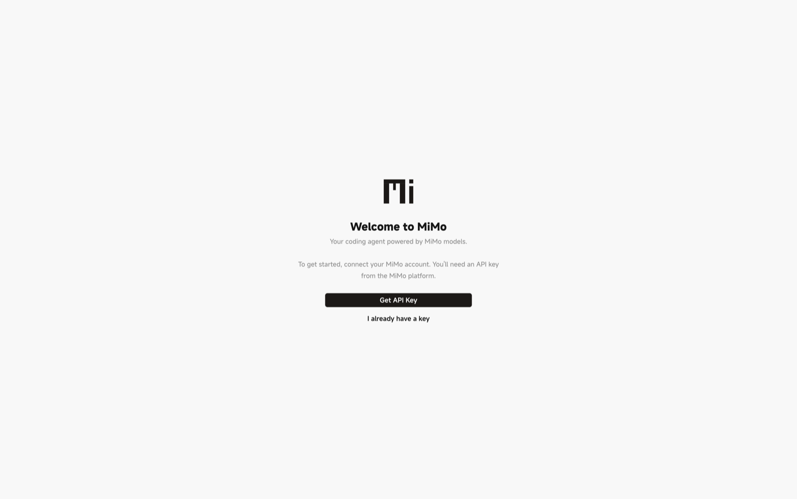
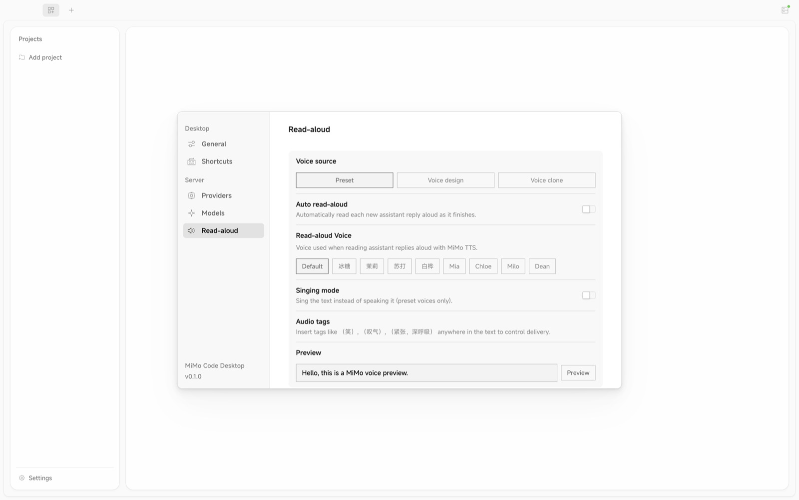

<div align="center">


# Mio — Desktop Agent for MiMo

**A native desktop coding agent for the MiMo model family.**

English | [简体中文](./README.zh-CN.md)

[](./LICENSE)






</div>

---

## What is Mio?

Mio is a free, open-source **native desktop coding agent for the MiMo model family**, available
for Windows and macOS. Instead of treating MiMo as a generic OpenAI-compatible provider, it makes MiMo
a first-class participant in the agent runtime — built on the OpenCode harness and adapted to be
MiMo-first. It brings coding, reasoning, multimodal understanding (image, PDF, and video), voice
dictation (ASR), and speech generation (TTS) together in a single desktop app.

## 🔊 Hear it

The intro voice on the **[landing page](https://shin4.github.io/mio/#capabilities)** was generated by Mio's own built-in TTS — the product demonstrating its own multimodal pipeline, not a recorded voiceover. **[▶ Listen →](https://shin4.github.io/mio/#capabilities)** · English voice *Chloe*, Chinese voice *冰糖*.

<details>
<summary>Transcript</summary>

> "The voice you're hearing right now was generated by Mio itself. It's a free, open-source desktop coding agent for the MiMo models — it reasons over your screenshots, PDFs and video, takes your prompts by voice, and reads its answers back. Built for Windows and macOS."

</details>

## Highlights

- **MiMo-native** — request shaping, model selection, and context packaging tuned for MiMo, not a generic provider skin.
- **Multimodal** — native image, PDF, and video understanding, plus voice dictation (ASR) and speech generation (TTS), powered by the full MiMo model lineup.
- **Cost-aware** — stable prefix-cache inputs for high cache-hit rates, visible token & cost accounting, and selection of the cheapest capable model for each task.
- **Desktop apps** — Windows & macOS, built on Electron. **No TUI planned.**

<div align="center">


<sub>The in-app status bar keeps cost & context in view — cache hit rate, prefix stability, context window, spend, and throughput, all at a glance.</sub>

</div>

## What you can do

- **Code with full multimodal context** — drop in screenshots, PDFs, or video and let MiMo reason over them while it edits code.
- **Drive coding by voice** — dictate prompts with built-in speech recognition (ASR) and have answers read back with text-to-speech (TTS).
- **Keep spend predictable** — every task is routed to the cheapest capable MiMo model, with token and cost shown as you go.
- **Run it beside upstream OpenCode** — project state stays isolated in `mio.json` and `.mio/`, so local config never mixes.

## How Mio differs

|  | Generic OpenAI-compatible client | Mio |
| --- | --- | --- |
| Request shaping & model selection | One-size-fits-all provider wrapper | Tuned per task across the MiMo model lineup |
| Multimodal & voice | Text-only, or bolted on later | Native image / PDF / video understanding + ASR + TTS |
| Cost control | Usually opaque | Stable prefix caching, visible token & cost accounting, cheapest capable model per task |
| Experience | Generic chat UI | Purpose-built Windows & macOS desktop app |

## Download

Grab the latest Windows and macOS builds from the
[Releases](https://github.com/shin4/mio/releases/latest) page — or build from source:

```bash
bun install
bun run dev:desktop
```

Installer builds: `bun run package:mac` and `bun run package:win` (Linux is also buildable with
`bun run package:linux`). See [CONTRIBUTING.md](./CONTRIBUTING.md) for the full setup.

## Connect to MiMo

Get an API key from [platform.xiaomimimo.com](https://platform.xiaomimimo.com) — pay-as-you-go
(`sk-…`) or a token plan (`tp-…`) — and add it in the app.

## FAQ

### What is Mio?

Mio is a free, open-source native desktop coding agent for the MiMo model family, available for
Windows and macOS. It makes MiMo models first-class participants in the agent runtime — coding,
reasoning, multimodal understanding, voice dictation, and speech — rather than a generic
OpenAI-compatible provider skin.

### Which MiMo models and capabilities does it support?

It supports text coding and reasoning, native multimodal understanding of images, PDFs, and video,
voice dictation (ASR), and speech generation (TTS), powered by the full MiMo model lineup.

### Which platforms does Mio run on?

Mio ships as Electron desktop apps for Windows and macOS. Linux is buildable from source, and
there is no terminal (TUI) version planned.

### Is Mio an official Xiaomi product?

No. Mio is an independent, community-maintained project. It is not affiliated with, sponsored by,
or endorsed by Xiaomi Inc., and it connects to the MiMo model platform purely as a third-party client.

### How is Mio different from a generic OpenAI-compatible client?

Unlike a generic provider skin, Mio tunes request shaping, model selection, and context
packaging specifically for MiMo. It adds native multimodal and voice capabilities, stable prefix
caching for high cache-hit rates, and visible token and cost accounting that routes each task to the
cheapest capable model.

### How much does it cost, and how do I get started?

The Mio app is free and MIT-licensed; you pay only for MiMo API usage. Download the latest
Windows or macOS build from the [Releases](https://github.com/shin4/mio/releases/latest) page,
then add a MiMo API key from [platform.xiaomimimo.com](https://platform.xiaomimimo.com) — pay-as-you-go
(`sk-…`) or a token plan (`tp-…`) — in the app.

## License

[MIT](./LICENSE). Mio is derived from [opencode](https://github.com/anomalyco/opencode); see
[NOTICE.md](./NOTICE.md) for attribution and third-party notices.

> **Disclaimer:** Mio is an independent, community-maintained project. It is not an official
> Xiaomi product and is not affiliated with, sponsored by, or endorsed by Xiaomi Inc. It connects to
> the MiMo model platform purely as a third-party client.
