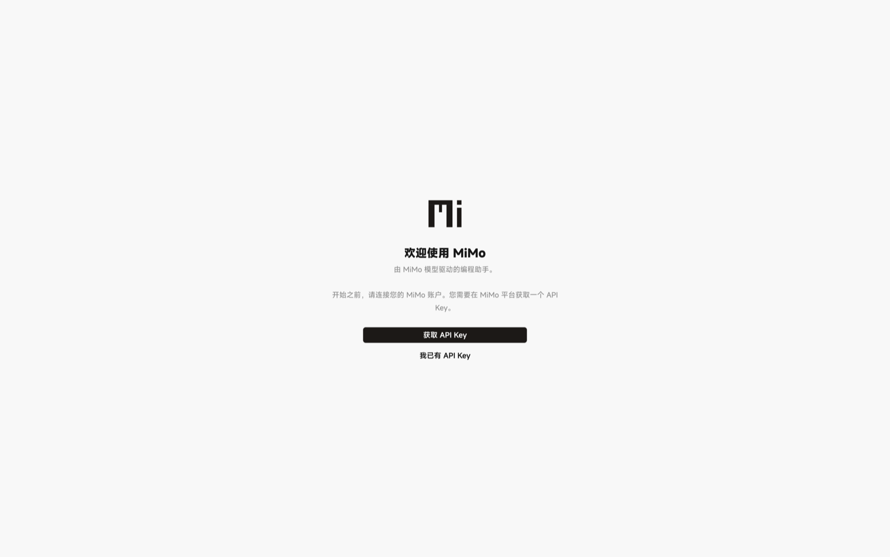
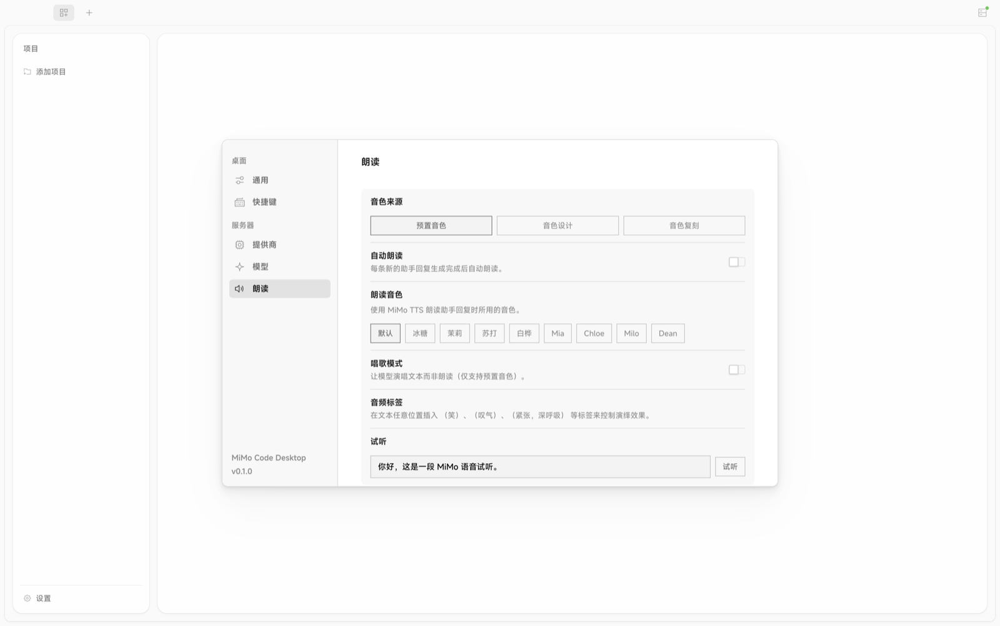

<div align="center">


# MiMo-Code

**为 MiMo 系列模型打造的原生桌面代码智能体。**

[English](./README.md) | 简体中文

[](./LICENSE)






</div>

---

## MiMo-Code 是什么？

MiMo-Code 是一款面向 **MiMo 模型家族**的免费开源原生桌面代码智能体，支持 Windows 与 macOS。它不把 MiMo
当作通用的 OpenAI 兼容提供商，而是让它成为智能体运行时中的一等公民——构建于 OpenCode harness 之上，并以
MiMo 为先。它把编程、推理、多模态理解（图像、PDF、视频）、语音听写（ASR）与语音生成（TTS）整合在同一个桌面应用中。

## 亮点

- **MiMo 原生** — 请求构造、模型选择与上下文打包都为 MiMo 调优，而非通用提供商的套壳。
- **多模态** — 原生的图像、PDF、视频理解，以及语音听写（ASR）与语音生成（TTS），支持 MiMo 全系列模型。
- **成本可控** — 稳定的前缀缓存输入带来高命中率，token 与成本清晰可见，并为每个任务选用最具性价比的可用模型。
- **桌面应用** — 基于 Electron 的 Windows 与 macOS 应用。**不计划提供终端界面（TUI）。**

## 能做什么

- **带完整多模态上下文编程** — 直接拖入截图、PDF 或视频，让 MiMo 在编辑代码的同时对它们进行推理。
- **用语音驱动编码** — 通过内置语音识别（ASR）口述提示，并让回答通过语音合成（TTS）朗读出来。
- **让花费可预期** — 每个任务都会被路由到最具性价比的可用 MiMo 模型，token 与成本实时可见。
- **与上游 OpenCode 并存** — 项目状态隔离在 `mimo.json` 与 `.mimo/` 中，本地配置互不混用。

## 与通用方案的区别

|  | 通用 OpenAI 兼容客户端 | MiMo-Code |
| --- | --- | --- |
| 请求构造与模型选择 | 一刀切的提供商套壳 | 针对 MiMo 全系列模型按任务调优 |
| 多模态与语音 | 仅文本，或事后拼接 | 原生图像 / PDF / 视频理解 + ASR + TTS |
| 成本控制 | 通常不透明 | 稳定前缀缓存、可见的 token 与成本核算、按任务选用最便宜可用模型 |
| 体验 | 通用聊天界面 | 为 Windows 与 macOS 打造的专用桌面应用 |

## 下载

前往 [Releases](https://github.com/shin4/mimo-code/releases/latest) 页面下载最新的 Windows 与 macOS 安装包，也可从源码构建：

```bash
bun install
bun run dev:desktop
```

构建安装包：`bun run package:mac`、`bun run package:win`（Linux 也可通过 `bun run package:linux` 构建）。
完整开发环境请见 [CONTRIBUTING.md](./CONTRIBUTING.md)。

## 连接 MiMo

前往 [platform.xiaomimimo.com](https://platform.xiaomimimo.com) 获取 API Key——按量付费（`sk-…`）
或订阅套餐（`tp-…`）——并在应用中填入。

## 常见问题

### 什么是 MiMo-Code？

MiMo-Code 是一款面向 MiMo 模型家族的免费开源原生桌面代码智能体，支持 Windows 与 macOS。它让 MiMo 模型成为
智能体运行时中的一等公民——编程、推理、多模态理解、语音听写与语音合成——而不是通用 OpenAI 兼容提供商的套壳。

### 它支持哪些 MiMo 模型与能力？

它支持文本编程与推理、对图像 / PDF / 视频的原生多模态理解、语音听写（ASR）以及语音生成（TTS），由 MiMo
全系列模型驱动。

### MiMo-Code 能在哪些平台运行？

MiMo-Code 以 Electron 桌面应用形式提供 Windows 与 macOS 版本。Linux 可从源码构建，且不计划提供终端界面（TUI）。

### MiMo-Code 是小米官方产品吗？

不是。MiMo-Code 是一个独立的、由社区维护的项目，与小米公司（Xiaomi Inc.）无附属、赞助或背书关系，仅作为
第三方客户端连接 MiMo 模型平台。

### 它与通用 OpenAI 兼容客户端有什么不同？

不同于通用的提供商套壳，MiMo-Code 专门针对 MiMo 调优请求构造、模型选择与上下文打包。它带来原生的多模态与语音
能力、用于提升缓存命中率的稳定前缀缓存，以及把每个任务路由到最便宜可用模型的可见 token 与成本核算。

### 它的费用如何？如何开始使用？

MiMo-Code 应用本身免费且采用 MIT 许可证，你只需为 MiMo API 用量付费。前往
[Releases](https://github.com/shin4/mimo-code/releases/latest) 下载最新的 Windows 或 macOS 安装包，然后在
应用中填入来自 [platform.xiaomimimo.com](https://platform.xiaomimimo.com) 的 API Key——按量付费（`sk-…`）
或订阅套餐（`tp-…`）。

## 许可证

[MIT](./LICENSE)。MiMo-Code 衍生自 [opencode](https://github.com/anomalyco/opencode)；归属与第三方声明见
[NOTICE.md](./NOTICE.md)。

> **声明：** MiMo-Code 是一个独立的、由社区维护的项目。它不是小米官方产品，与小米公司（Xiaomi Inc.）无附属、
> 赞助或背书关系。它仅作为第三方客户端连接 MiMo 模型平台。
